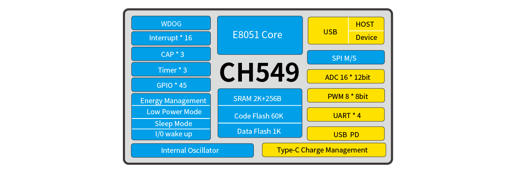
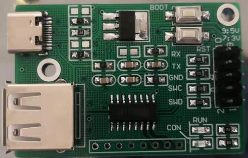

# [CH549](https://github.com/SoCXin/CH549)

* [WCH](http://www.wch.cn/)：[8051](https://github.com/SoCXin/8051)
* [L2R2](https://github.com/SoCXin/Level)：48 MHz

## [简介](https://github.com/SoCXin/CH549/wiki)

[CH549](https://github.com/SoCXin/CH549) 兼容MCS51的增强型E8051内核，79%指令是单字节单周期指令，3KB BootLoader + 60KB CodeFlash，2K xRAM + 256B iRAM，1K DataFlash。

支持 USB-Host主机模式和 USB-Device设备模式，内置FIFO支持最大64字节数据包,支持DMA，支持 USB 2.0 全速 12Mbps，支持USB PD和Type-C。

通信接口包括4组异步串口、8路PWM和16通道电容触摸按键，其它包括1路主从SPI，16路12位ADC，支持电压比较；内置3组定时器和3路信号捕捉。

#### 关键特性

* Type-C CC控制
* USB全速主/从模式
* UART x 4 + SPI (M/S)
* 16通道12位ADC，支持电压比较

### [资源收录](https://github.com/SoCXin)

* [参考资源](src/)
* [参考文档](docs/)
* [参考工程](project/)

### [选型建议](https://github.com/SoCXin)

[CH549](https://github.com/SoCXin/CH549) 的特色Type-C和USB-PD，具备4串口满足数据传输需求，相较于[CH554](https://github.com/SoCXin/CH554)拥有更多资源和存储，但具有兼容性。

* CH549L:LQFP48 (7*7mm)
* CH549F:QFN28 (4*4mm)
* CH549G:SOP16

#### 相关开发板

### [探索芯世界 www.SoC.xin](http://www.SoC.Xin)
